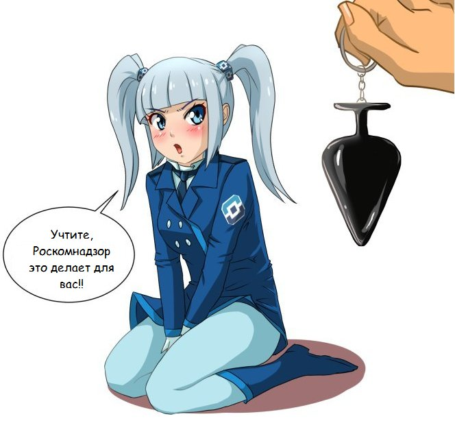
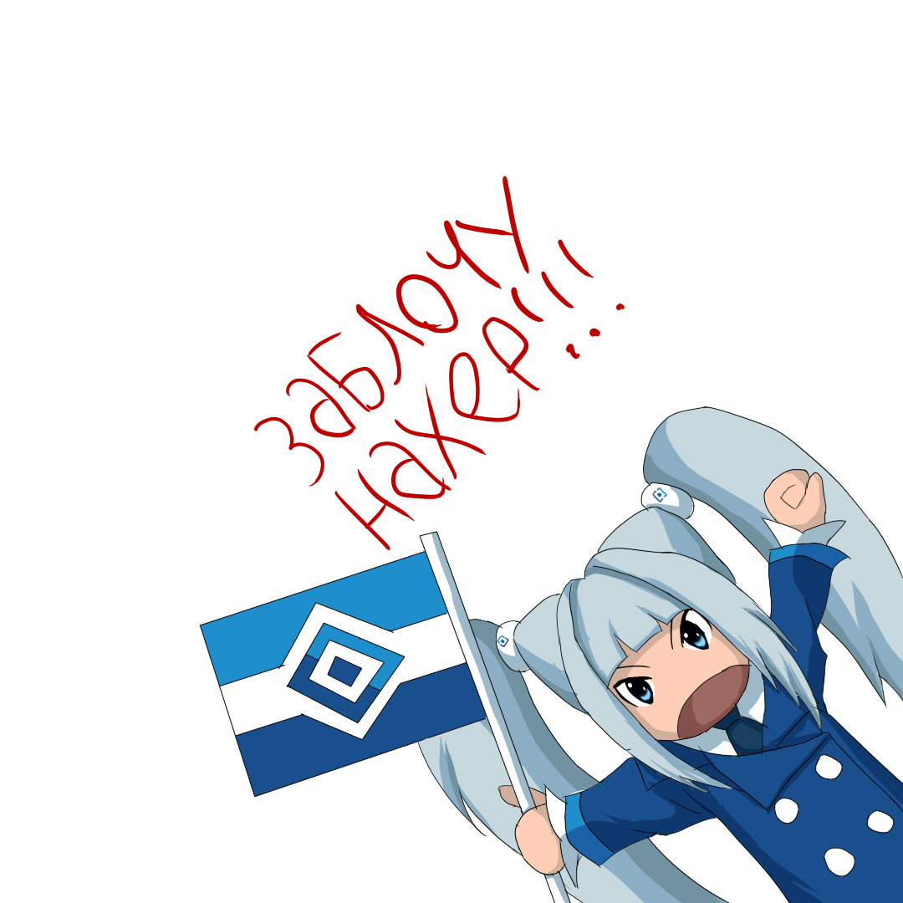

С каждым днём гайки закручиваются всё сильнее и сильнее. На этот раз [Роскомнадзор рекомендовал владельцам ресурсов в интернете отказаться от использования CDN-сервиса CloudFlare](https://habr.com/ru/news/856722/). В целом на это можно было бы не обращать внимания, если бы это не была бы очередная попытка положить немалую часть интернета. И мои сайты в том числе.

Дело в том, что я для своих сайтов использую CloudFlare. Это прекрасный сервис, который берёт на себя заботы о фильтрации ботов, скрытии IP адресов серверов, защите от DDOS атак, кешировании и отдаче статичных файлов и многом другом при этом делает всё это БЕСПЛАТНО.

А теперь мне предлагают отказаться от такого лакомого кусочка, который снимает с меня немалую часть головной боли, при этом, не предлагая ничего взамен, хоть сколько-нибудь досягаемого его уровня.

Если мы обратимся к первоисточнику, сможем увидеть следующее:

> Рекомендуем владельцам информационных ресурсов отключить расширение TLS ECH или, что правильнее, использовать отечественные CDN-сервисы, которые обеспечивают надёжное и безопасное функционирование ресурсов и защиту от компьютерных атак.

Хорошо, а какие? Можно списочек? И чтобы бесплатный тариф как CloudFlare был, чтобы от перехода на такой аналог был хоть какой-то смысл.

> В частности, защиту от DDoS-атак может обеспечить Национальная система противодействия DDoS-атакам (НСПА).

Что это и где это найти? Она даже не гуглится (яндексится).

Действия РКН-а убивают оставшиеся после блокировок нервы и вредят IT-индустрии в стране. Организация, которая должна по идее помогать развивать интернет просто-напросто губит его.

## А в чём собственно суть?

На днях, придя вечером после работы, я по какой-то причине хотел открыть один из своих сайтов. И вот не увидев по прошествию времени загруженный сайт, я уже начал думать, что опять что-то не так со стороны Ростелекома. Но другие сайты грузились. И какого было моё удивление, когда сайт загрузился через прокси. И тут я понял, что это край. **ЧЁРТ, Я НЕ МОГУ ВОСПОЛЬЗОВАТЬСЯ СВОИМ НОРМАЛЬНЫМ ЧИСТЫМ САЙТОМ!!!**

**_Спрашивается, какого хрена? Почему меня лишают нормального доступа в интернет? За что я вообще плачу деньги?_**

Я не обращал внимания на блокировки инсты или лицокниги так как ими не пользовался. Я со скрипом приспособился к ~~блокировке~~, ах ну да точно, замедлению Ютуба. Видите ли, все сервера, как по щелчку пальцев, резко устарели.  
Но блокировка Дискорда выбила меня из колеи. Ну что вам сука сделал сервис для общения? Террористы? Наркодилеры? Да я больше поверю в то, что в ВК этого "добра" куда больше (а ведь так оно и есть).

Серьёзно, это ж насколько нужно было обосраться, чтобы пришлось менять алгоритм поиска информации о блокировках на сайте РКН-а. Т.е. они намеренно усложнили доступ к информации, которая должна публиковаться публично. А всё почему? Да потому что в той же Телеге или ВК такого говна реально куда больше. Но почему-то ВК у нас такой, сука, неприкасаемый. И после такой находки народ естественно начал тыкать РКН мордой в эту самую кучу.

И ладно, можно со скрипом поверить (ага, конечно) что ВК как-то борется со всеми этими нарушениями, но при этом они же параллельно, при блокировке Ютуба, [запускают рекламную кампанию](https://vk.com/wall-161682482_68819) о том, что "видите ли, ютуб тормозит, а мы такие крутые нам всё нипочём". Ну-ну, только при этом ютуб тормозит исключительно внутри страны т.к. его нормальной работе мешает РКН, а у самих при этом всё тормозит и лагает, потому как код написан теми ещё рукожопами. Да и в момент блокировки Дискорда неожиданно оказалось, что [они разрабатывают](https://vk.com/wall-188932186_3783) его аналог.

При этом ещё и блогеров тупо выкупают, вместо того чтобы нормально вкладываться в развитие своей площадки. О той рекламе ВК и прочих грязных действиях, кстати, высказывался один из купленных блогеров. В итоге видео со своего канала он удалил. Правда интернет-то [всё равно всё помнит](https://youtu.be/tSXvWgQJsAY).

_На что не пойдёшь ради бабок._

## Новые подробности о Дискорде

> Я этот пост начинал писать ещё 7 ноября, но не успел его дописать. В итоге закрутился в рутине и на эту тему в принципе забил. Но вот сегодня (18 ноября) мне попался интересный видос, который открыл глаза на некоторые моменты. И жопа моя загорелась с новой силой (хотя конечно не так ярко как в первый раз).

Опять же я хотел много что расписать, но в целом это всё есть в видео. Единственное, что я скажу - это пиздец. Просто какие-то левые челы в своих корыстных целях топили платформу, ещё вирусняк писали, а это уже вообще на уголовку тянет ([Статья 273 УК РФ](https://www.consultant.ru/document/cons_doc_LAW_10699/a4d58c1af8677d94b4fc8987c71b131f10476a76/)).

Если верить GPT, то списочек правонарушений получается ещё больше (неподходящее удалил):

> В данной ситуации могут быть нарушения в нескольких аспектах российского законодательства:
>
> 1. **Использование вредоносного программного обеспечения**: Установка вредоносных программ с целью блокировки работы Discord может нарушать **статьи Уголовного кодекса РФ** (например, ст. 273 "Создание, использование и распространение вредоносных программ для ЭВМ"), что карается штрафами и лишением свободы.
>
> 2. **Нарушение прав потребителей**: Принудительная установка ПО без возможности его удаления может нарушать права пользователей и правила **защиты информации**, регулируемые законодательством РФ.
>
> 3. **Клевета и распространение ложных сведений**: Представление ложной информации о том, что Discord "вреден для здоровья" и содержит "агрессивные элементы", может нарушать **статью 128.1 УК РФ о клевете**, если такая информация способна нанести ущерб репутации. _(Не уверен в правоприменении к компании, но возможно подходит пункт 2 данного закона)_
>
> 4. **Нарушение конкуренции**: Если действия движения связаны с ограничением конкуренции или преднамеренным нанесением ущерба компании (например, путем использования дезинформации и финансовых махинаций), это может подпадать под **антимонопольное законодательство**.
>
> 5. **Нарушение закона о сборе данных и защите персональных данных**: Если в ходе деятельности незаконно собирались или использовались персональные данные, это будет нарушением **Федерального закона № 152-ФЗ "О персональных данных"**.
>
> Совокупность этих аспектов делает подобные действия потенциально противозаконными и подлежащими расследованию компетентными органами, такими как ФАС и правоохранительные органы.

и болеее подробнее по моменту с серверами TeamSpeak-а:

> Требование для новых участников клана оплачивать серверы TeamSpeak, особенно если те, кто выдвигает такие требования, сами являются владельцами сервиса по аренде серверов, может подпадать под ряд нарушений, в зависимости от контекста:
>
> 1. **Конфликт интересов и недобросовестная практика**: Если владельцы сервиса используют свое положение для вынужденного направления участников клана на аренду серверов у себя, это может быть расценено как недобросовестная практика. Такая ситуация может нарушать принципы справедливой конкуренции и приводить к потенциальным антимонопольным вопросам.
>
> 2. **Вымогательство**: Если требование оплачивать сервера сопровождается угрозами или принуждением (например, исключение из клана или запрет на участие), это может трактоваться как вымогательство, что является уголовно наказуемым деянием (ст. 163 УК РФ "Вымогательство"). Однако, если подобные требования оформлены в виде добровольного взноса или условием участия, без угроз и принуждения, это, скорее всего, не будет считаться вымогательством.
>
> 3. **Недобросовестное получение выгоды**: Если владельцы клана или организаторы извлекают личную выгоду от платы, не раскрывая этот факт участникам, это может рассматриваться как обман или введение в заблуждение. Подобные действия могут нарушать нормы **гражданского права** и быть предметом разбирательства по поводу недобросовестного обогащения.
>
> 4. **Этические вопросы**: Даже если такие требования законны, они могут поднимать этические вопросы о прозрачности и честности действий владельцев клана.
>
> Чтобы однозначно классифицировать действия как вымогательство или иное нарушение, необходимо учитывать детали контекста, включая добровольность участия и уровень прозрачности в отношениях между владельцами и участниками.

Честно я даже подумываю о том, чтобы подать заявление на этих ублюдков. Потому как на лицо имеется нездоровая конкуренция и злоупотребление возможностями.
Но думаю об этом как-нибудь в другой раз.



## Итоги

Что я могу сказать по поводу всего этого... Я ненавижу ВК. Я ненавижу РКН. Их "рекомендации" выполнять не намерен. Пускай ограничивают свободу слова и доступа к информации, я буду обходить все возможные блокировки и если меня кто попросит, помогу им в этом.

Я блин банально не могу исполнять свои обязанности как IT-специалист, так как часть сервисов ушла из страны и открестилась от нас. Часть просто не работает потому-что инет у нас к хренам поломали. Порой даже для того, чтобы прочитать документацию к какой-либо библиотеке или любому другому софту, приходится включать ВПН или прокси т.к. сайты банально не грузятся при том, что они даже НЕ ЗАБЛОКИРОВАНЫ.

_Пиздец..._
