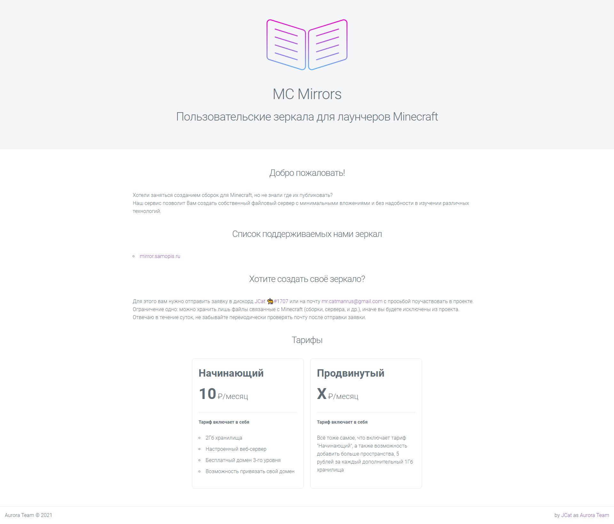

# TL;DR

> За 3 месяца работы проекта, им интересовалось около 4-5 человек. Из них было 3 "клиента", один из которых дейстительно развивал своё зеркало.

# Ожидания == Реальность

Как я и ожидал проект мало кого заинтересует, ибо мало кто хочет заниматься ковырянием в сборках. В основном все любят потреблять уже готовое.

Конечно я думал что от части проблема состоит в том, что у людей есть сложности с поднятием своего зеркала, поиска площадки для хранения всего своего добра (помню кто-то свои сборки даже на гитлаб грузил). Но на самом деле ситуация такова, что сборками просто занимаются единицы. И для них в принципе нет проблем поднять своё зеркало (если бы они конечно же хотели это делать).

Хотя более вероятнее причина в том, что не все знают и понимают как это делать, либо им просто лень))

По большей части я ожидал подобных результатов, особенно учитывая что я практически никак не рекламировал проект (только на старте и то по парочке гилдов в Discord) и зная какого вообще заниматься сборками, с учётом всей возни с имеющимися на данных момент лаунчерами.

На самом деле я мог накинуть немного рекламы и попытаться как-то развивать проект, но честно не вижу в этом смысла))  
Да, и в принципе, я посчитал что я себе только добавляю лишнего гемора.  
_(К слову, на случай если проект выстрелит, я собирался написать небольшую панель управления для проекта, но как видите - не получилось, не фартануло XD)_

## А что тут вообще было? Я всё пропустил.

>  _Прошлый сайт проекта MC Mirrors_

Можно сказать, что это был статичный хостинг файлов, на котором вы могли разместить свои сборки без возни с настройкой сервера, подключением доменов и прочей мелочи.

> Хотели заняться созданием сборок для Minecraft, но не знали где их публиковать?
> Наш сервис позволит Вам создать собственный файловый сервер с минимальными вложениями и без надобности в изучении различных технологий.
> _--- Говорилось на сайте проекта_

Первые пару месяцев был доступен бесплатный "тариф", на котором вы могли протестировать систему. Позже я это убрал, сделав минимальный тариф в 10 рублей в месяц.

По сути то была обычная машинка на облаке Hetzner с настроенным nginx и sftp доступом. Расчитывалась, что всё это будет работать на основе блочных хранилищ, потому и цена в итоге получилась минимальной. В расчёт была включена только плата за хранилище, ну а машинку я уже тянул за свой)

Забавно в итеге то, что до блочных хранилищ в итоге дело не дошло, но я всё-таки успел немножечко их поковырять.

# А что дальше то?

Сейчас я думаю сделать здесь небольшой бложик на тему майна и работы со сборками и зеркалами, ну и возможно что-то ещё. Возможно когда-нибудь я снова подниму этот проект, если вдруг появится интерес, ну а пока как-то так)
